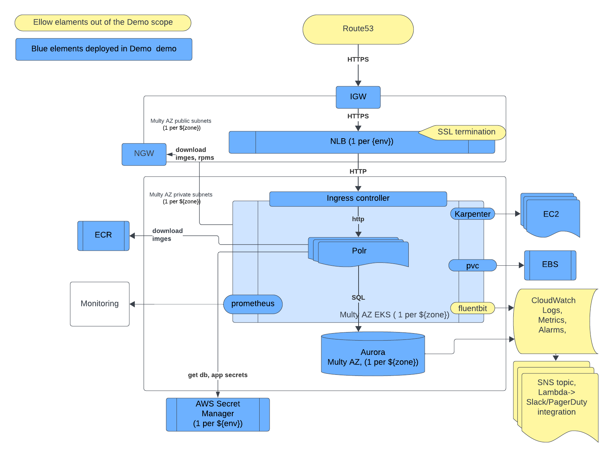

# terraform-aws-eks-app

## aws Components

- az: ["eu-west-1a", "eu-west-1a", "eu-west-1a", ]
- vpc
- eks
- rds
- ecr
- secrets

## Architecture design



- polr as URL Shortening App
- Use aws rds aurora serverless as storage
- eks in private subnet as container's platform
- karpenter as eks node autoscaler
- prometheus for monitoring
- NLB in public subnet to expose application
- AWS Secrets for app admin and db admin secrets source
- AWS ECR as storage for container image artifacts
- Route53 and ALB-TLS configuration are not implemented in demo due these configuration requires domain registration


## how to deploy 

Prereqisites
- aws user key id  and access key for terrafrorm 
- makefile https://formulae.brew.sh/formula/make
- docker https://formulae.brew.sh/formula/docker
(tested only macos arm64) 

0. aws access config:

copy AWS admin keys into infrastructure/.env
```
AWS_ACCESS_KEY_ID=******
AWS_DEFAULT_REGION=eu-west-1
AWS_SECRET_ACCESS_KEY=******
```
0. update s3 bucket names

AWS_ACCOUNT_NAME=changeme

```
./infrastructure/init_scripts/terraform-s3-create-bucket-eu-west-1.sh
```

**changeme**-terraform-aws-eks-app-state-eu-west-1 -> **<your_account_name>**-terraform-aws-eks-app-state-eu-west-1
in next files:

```
./infrastructure/terraform/app/configs/backend/dev-eu-west-1.sh
./infrastructure/terraform/infra/configs/backend/default-eu-west-1.sh
./infrastructure/terraform/vpc/configs/backend/default-eu-west-1.sh

```


1. buid docker shell

``` bash
cd shell
make shell
```

in shell export AWS credentials
``` shell
export $(cat /repo/infrastructure/.env | xargs)
```

2. create terraform backend s3 bucket and dynamodb for terrafrom lock

in shell:
``` shell
cd /repo/infrastructure/init_scripts/

./terraform-s3-create-bucket-eu-west-1.sh

./terraform-dynamodb-create-table-eu-west-1.sh

```

3. deploy aws vpc resources(time ~5m)

in shell:
``` shell
cd /repo/infrastructure/terraform/vpc/
make fmt
make validate
REGION=eu-west-1 make apply-plan
```

4. deploy aws infra(eks, aurora rds) resources(time ~30m)

- init rds and eks
in shell:
``` shell
cd /repo/infrastructure/terraform/infra/
make fmt
make validate
make apply-plan
```
- init eks system's pod's
udpdate vars in /repo/infrastructure/terraform/infra/configs/default-eu-west-1.tfvars
```
cluster_is_deployed -> true
```
in shell
``` shell
make fmt
make validate
make apply-plan
```
- init eks infra pod's and config's
udpdate vars in /repo/infrastructure/terraform/infra/configs/default-eu-west-1.tfvars
```
karpenter_config_count -> 1
ingress_nginx_lb_count -> 1
monitoring_enabled -> 1
```
in shell
``` shell
make fmt
make validate
make apply-plan
```

check eks cluster and pod's statuses
``` shell
aws eks update-kubeconfig --region eu-west-1 --name infra-default-cl-ew1
k get nodes
k get pods -A
kubectl get cm -n kube-system aws-auth -o yaml
```

4. build docker for app resources(time ~10m)

``` shell
cd /repo/app_polr
make push
```
if you hget docker access issue - run as workaround next:
sudo chmod 666 /var/run/docker.sock

5. deploy app

in shell:
``` shell
cd /repo/infrastructure/terraform/app/
make fmt
make validate
make apply-plan
```

chech app status

 - go to **polr_url** to chech ghost status
 - go to admin to check admin configs (find username and password in aws-secrets)

6. test performance
``` shell
cd /repo/infrastructure/testing_scripts/
./latency_test.sh < **polr_url** >
```

## how to clean up installation

1. destroy aws resources:

in shell:
``` shell
cd /repo/infrastructure/terraform/app/
make destroy

cd /repo/infrastructure/terraform/infra/
make destroy

cd /repo/infrastructure/terraform/vpc/
make destroy

```

2. delete terrafrom  dynamod db tables and s3 bucket via aws console


